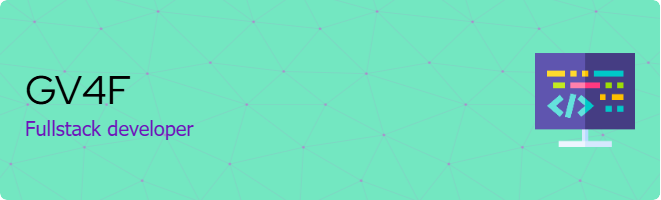

# Hi Coders, I´m Angel

 


I´m student of programming. I love to learn new technologies, acquire new skills and i´m passionate about facing new challenges. I´m currently into web development and working on imporving my Data Structures and Algorithms skills.

## Technologies Stack


 ## Who am I?
 ```c#
 internal class WhoIAm
{
  string fullname = "Angel Caal";
  int age = 18;
  List<string> hobbies = [ "Reading", "Learn Math", "Listening to music", "Learn Physics", "Train Calisthenics" ];

  public string GetCity()
  {
    return "Guatemala City";
  }
  public void Ambitions()
  {
    Console.WriteLine("I want to be a software engineer.");
    Console.WriteLine("I want to learn Japanese.");
    Console.WriteLine("I want to learn C.");
    Console.WriteLine("I would love to learn cybersecurity.");
  }
}
 ```
