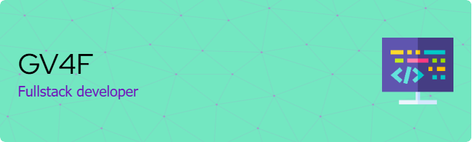

# Hi Coders, I´m Angel 

Hi, I am a Self-Taught programming student. I love to learn new technologies, acquire new skills and I'm passionate about facing new challenges. I'm currently into backend development and mobile application development.

**Next year, I'm starting university to study Software Engineering.** 🎉🎉


## 🌐 Connect with me 

<p align="center">
  <a href="mailto:angelcaal0619@gmail.com">
    
  </a>
  <a href="www.linkedin.com/in/angel-caal-b94305351">
    
  </a>
  <a href="https://www.instagram.com/gv4f_">
    
  </a>
</p>

## 💻 Tech Stack
### Web Stack


### Development Stack


### Database


### DevOps


 ```c#
 internal class WhoIAm
{
  public string name;
  public int age;
  public List<string> hobbies;

  public WhoIAm()
  {
    name = "Angel";
    age = 19;
    hobbies = [ "Reading", "Listen to music", "Learn Physics", "Learn new skill's", "Try a new things"];
  }

  public string GetCity()
  {
    return "Guatemala City";
  }

  public void Ambitions()
  {
    Console.WriteLine("I want to be a software engineer.");
    Console.WriteLine("I want to learn Japanese.");
    Console.WriteLine("I want to learn about Electronic Engineer");
    Console.WriteLine("I would love to learn Cybersecurity.");
  }

  public void Philosophy()
  {
    Console.WriteLine("Jack of all trades is a master of none... but often times better than a master of one");
  }
}
 ```
